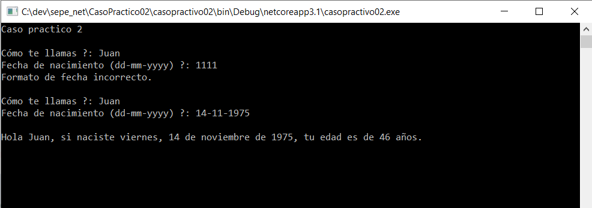

## Caso Práctico 2
***

A continuación se muestra el código utilizado para esta práctica.

~~~vbnet
    Sub Main(args As String())

        'Variable declaration
        Dim dNace As Date
        Dim sName As String
~~~

Se define un bucle para la introducción de los datos hasta que el tipo sea el correcto. Para controlar el formato de la fecha de nacimiento, se añade un control de excepciones.

~~~vbnet
        ' Loop until correct user input
        Do While True
            ' User input
            Console.Write("Cómo te llamas ?: ")
            sName = Console.ReadLine()

            Console.Write("Fecha de nacimiento (dd-mm-yyyy) ?: ")
            Try
                dNace = Console.ReadLine()
            Catch e As Exception
                ' Entrada incorrecta del usuario. Pide nueva entrada
                Console.WriteLine("Formato de fecha incorrecto." + vbCrLf)
                Continue Do
            End Try

            ' Salida del bucle al tener el formato correcto
            Exit Do
        Loop
~~~

Una vez verificada la correcta introducción de los datos, se pasa a ralizar los cálculos correspondientes y dar salida por consola a los resultados para dar por finalizado el programa.

Para este caso práctico, se ha realizado el cálculo de la edad a partir únicamente del año del nacimiento, obtiendo el cálculo de la edad al finalizar el año.

~~~vbnet
        ' Salida formateada
        ' Se omiten cálculos complejos para el cálculo de la edad correcta. Salida aproximada.
        Console.WriteLine()
        Console.WriteLine("Hola {0}, si naciste {1}, tu edad es de {2} años.", sName, dNace.ToString("D"), Today.Year - dNace.Year)

        ' Wait on Console to see result
        Console.ReadKey()
    End Sub
End Module
~~~

 Un ejemplo de ejecución del programa, incluyendo una introducción incorrecta de la fecha de nacimiento, sería:

 

 El código del programa se puede descargar desde [aquí](https://github.com/jnestruch/sepe_net/blob/master/CasoPractico02/casopractico02/casopractico02/Program.vb).