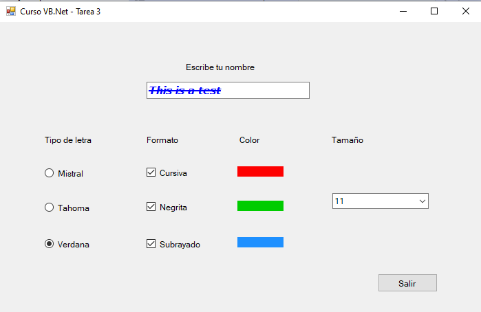

## Caso Práctico 3
***

A continuación se muestra el código utilizado para esta práctica junto con el formulario final.

La propiedad de Fuente del objeto TextBox es inmutable, por lo que para su modificación, es necesario crear un nuevo objeto ***Font*** con las nuevas propiedades del objeto. Esto aplica para todos los cambios previstos en este caso práctico excepto para el color, donde es suficiente con asignar el nuevo color a partir del objeto de sistema ***Color***.

Captura del formulario resultante:

 

  
### Formulario: Objetos incluidos
  

 | | Nombre | Valor |
 --- | --- | ---
**Objeto:** | Form | 
**Propiedades:** | Name | Form1
| | Text | Curso VB'.Net - Tarea 3
| | Font | Microsoft Sans Serif; 9pt

  

--------

 

 ### Controles para texto a formatear

  

 | | Nombre | Valor |
 --- | --- | ---
**Objeto:** | Label | 
**Propiedades:** | Name | Label1
| | Text | Escribe tu nombre
| | Font | Microsoft Sans Serif; 9pt

  
 | | Nombre | Valor |
 --- | --- | ---
**Objeto:** | TextBox | 
**Propiedades:** | Name | TextBox1
| | Text | 
| | Font | Microsoft Sans Serif; 9pt
| | ForeColor | Black

  

--------

 

 ### Controles de etiquetas

  
 | | Nombre | Valor |
 --- | --- | ---
**Objeto:** | Label | 
**Propiedades:** | Name | Label2
| | Text | Tipo de letra
| | Font | Microsoft Sans Serif; 9pt

  
 | | Nombre | Valor |
 --- | --- | ---
**Objeto:** | Label | 
**Propiedades:** | Name | Label3
| | Text | Formato
| | Font | Microsoft Sans Serif; 9pt

  
 | | Nombre | Valor |
 --- | --- | ---
**Objeto:** | Label | 
**Propiedades:** | Name | Label4
| | Text | Color
| | Font | Microsoft Sans Serif; 9pt

  
 | | Nombre | Valor |
 --- | --- | ---
**Objeto:** | Label | 
**Propiedades:** | Name | Label5
| | Text | Tamaño
| | Font | Microsoft Sans Serif; 9pt

  

---------
 

 ### Controles de tipo de fuente
 
   

 | | Nombre | Valor |
 --- | --- | ---
**Objeto:** | RadioButton | 
**Propiedades:** | Name | rbMistral
| | Text | Mistral
**Evento:** | CheckedChanged | Radiobutton1_CheckedChanged
**Codigo:** |
~~~vbnet
    TextBox1.Font = New Font(rbMistral.Text, TextBox1.Font.Size, TextBox1.Font.Style)
~~~
---
  
----
 | | Nombre | Valor |
 --- | --- | ---
**Objeto:** | RadioButton | 
**Propiedades:** | Name | rbTahoma
| | Text | Tahoma
**Evento:** | CheckedChanged | Radiobutton2_CheckedChanged
**Codigo:** |
~~~vbnet
    TextBox1.Font = New Font(rbTahoma.Text, TextBox1.Font.Size, TextBox1.Font.Style)
~~~
  

 | | Nombre | Valor |
 --- | --- | ---
**Objeto:** | RadioButton | 
**Propiedades:** | Name | rbVerdana
| | Text | Verdana
**Evento:** | CheckedChanged | Radiobutton3_CheckedChanged
**Codigo:** |
~~~vbnet
    TextBox1.Font = New Font(rbVerdana.Text, TextBox1.Font.Size, TextBox1.Font.Style)
~~~
  

---------
 

 ### Controles de Formato

   

 | | Nombre | Valor |
 --- | --- | ---
**Objeto:** | CheckBox | 
**Propiedades:** | Name | chkItalic
| | Text | Verdana
**Evento:** | CheckedChanged | CheckBox1_CheckedChanged
**Codigo:** |
~~~vbnet
        If chkItalic.Checked Then
            TextBox1.Font = New Font(TextBox1.Font.Name, TextBox1.Font.Size, TextBox1.Font.Style Or FontStyle.Italic)
        Else
            TextBox1.Font = New Font(TextBox1.Font.Name, TextBox1.Font.Size, TextBox1.Font.Style And Not FontStyle.Italic)
        End If
~~~
  

 | | Nombre | Valor |
 --- | --- | ---
**Objeto:** | CheckBox | 
**Propiedades:** | Name | chkBold
| | Text | Verdana
**Evento:** | CheckedChanged | CheckBox2_CheckedChanged
**Codigo:** |
~~~vbnet
        If chkVerdana.Checked Then
            TextBox1.Font = New Font(TextBox1.Font.Name, TextBox1.Font.Size, TextBox1.Font.Style Or FontStyle.Bold)
        Else
            TextBox1.Font = New Font(TextBox1.Font.Name, TextBox1.Font.Size, TextBox1.Font.Style And Not FontStyle.Bold)
        End If
~~~
  

 | | Nombre | Valor |
 --- | --- | ---
**Objeto:** | CheckBox | 
**Propiedades:** | Name | chkStrike
| | Text | Verdana
**Evento:** | CheckedChanged | CheckBox3_CheckedChanged
**Codigo:** |
~~~vbnet
        If chkVerdana.Checked Then
            TextBox1.Font = New Font(TextBox1.Font.Name, TextBox1.Font.Size, TextBox1.Font.Style Or FontStyle.Strikeout)
        Else
            TextBox1.Font = New Font(TextBox1.Font.Name, TextBox1.Font.Size, TextBox1.Font.Style And Not FontStyle.Strikeout)
        End If
~~~
  

---------
 

 ### Controles de color

 Los colores en los controles **Label** se han conseguido asignando unos ficheros de imagen de colores para conseguir el efecto deseado.

 

 | | Nombre | Valor |
 --- | --- | ---
**Objeto:** | Label | 
**Propiedades:** | Name | lblRed
| | Image | System.Drawing.Bitmap
**Evento:** | Click | Label6_CheckedChanged
**Codigo:** |
~~~vbnet
        TextBox1.ForeColor = Color.Red
~~~
  

 | | Nombre | Valor |
 --- | --- | ---
**Objeto:** | Label | 
**Propiedades:** | Name | lblGreen
| | Image | System.Drawing.Bitmap
**Evento:** | Click | Label7_CheckedChanged
**Codigo:** |
~~~vbnet
        TextBox1.ForeColor = Color.Green
~~~
  

 | | Nombre | Valor |
 --- | --- | ---
**Objeto:** | Label | 
**Propiedades:** | Name | lblBlue
| | Image | System.Drawing.Bitmap
**Evento:** | Click | Label8_CheckedChanged
**Codigo:** |
~~~vbnet
        TextBox1.ForeColor = Color.Blue
~~~
  

---------
 

 ### Controles de tamaño

  

 | | Nombre | Valor |
 --- | --- | ---
**Objeto:** | ComboBox | 
**Propiedades:** | Name | cmbSize
| | Image | System.Drawing.Bitmap
**Evento:** | SelectedIndexChanged | ComboBox1_SelectedIndexChanged
**Codigo:** |
~~~vbnet
        TextBox1.Font = New Font(TextBox1.Font.Name, cmbSize.SelectedItem, TextBox1.Font.Style)
~~~
  

---------
 

 ### Controles de salida

  

 | | Nombre | Valor |
 --- | --- | ---
**Objeto:** | Button | 
**Propiedades:** | Name | Button1
| | Text | Salir
**Evento:** | Click | Button1_Click
**Codigo:** |
~~~vbnet
    Me.Close()
~~~
 El código del programa se puede descargar desde [aquí](https://github.com/jnestruch/sepe_net/tree/master/CasoPractico03/casopractico3/).